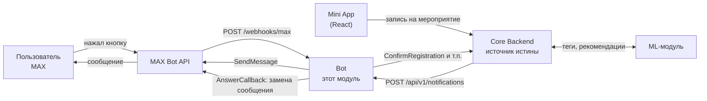
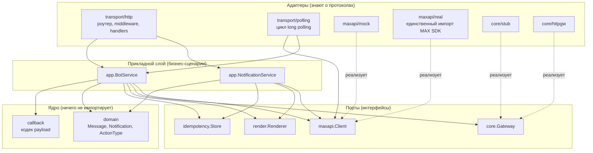
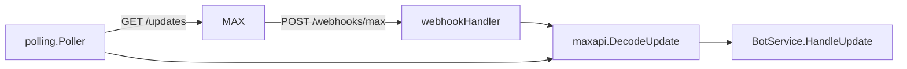
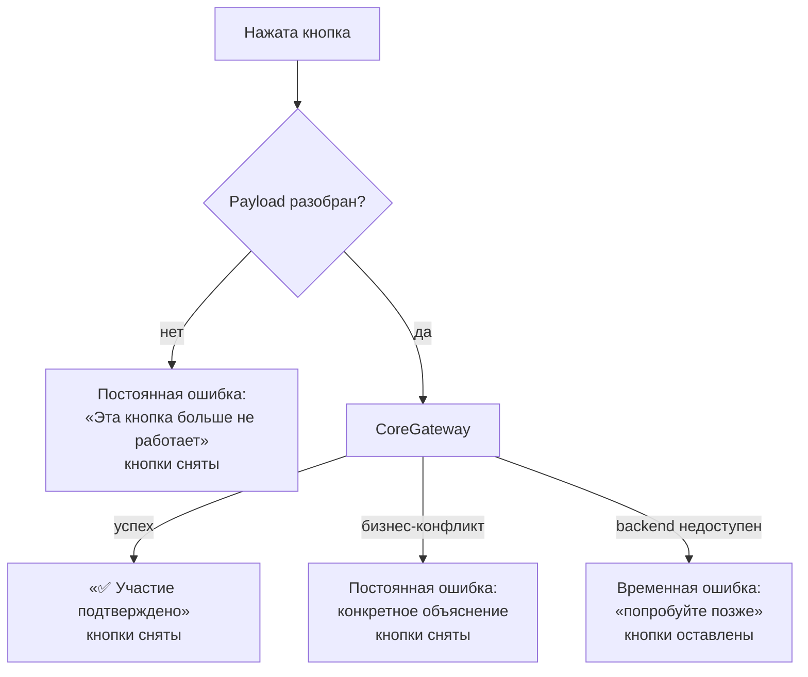
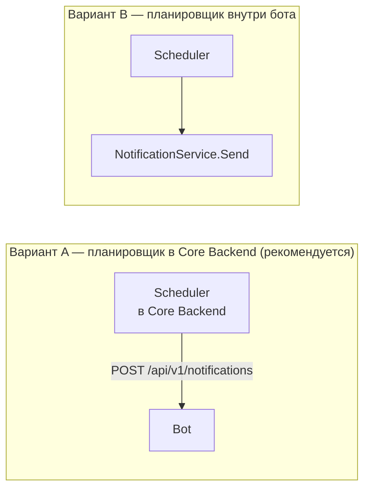

# Архитектура

Документ объясняет, как устроен модуль бота, почему он устроен именно так и
где проходят границы, которые не стоит нарушать.

---

## 1. Место бота в системе

Бот — адаптер между системой и мессенджером MAX. Он ничем не владеет.



### Что решает Core Backend, а не бот

Список намеренно длинный, потому что соблазн «быстренько проверить в боте»
возникает почти на каждом пункте:

- есть ли свободные места;
- можно ли зарегистрировать пользователя;
- кто следующий в листе ожидания;
- разрешена ли отмена;
- верифицирован ли пользователь;
- какие мероприятия рекомендовать;
- какие теги присвоил ML;
- существует ли мероприятие;
- является ли пользователь участником.

Бот делает ровно десять вещей: получает команду на отправку, формирует текст,
формирует клавиатуру, отправляет сообщение, принимает webhook, проверяет
секрет, разбирает callback в типизированное действие, передаёт действие через
`CoreGateway`, получает результат, обновляет сообщение или показывает понятную
ошибку.

Практическое следствие: если в боте появляется `if freeSeats > 0`, это ошибка
проектирования, а не удачная оптимизация.

---

## 2. Слои и зависимости



Правило простое: **стрелки идут только внутрь**. `domain` не знает ни про HTTP,
ни про MAX, ни про JSON. `app` не знает, что его вызвали по HTTP. Ни один пакет,
кроме `maxapi/real`, не импортирует SDK MAX.

Проверить это можно буквально:

```bash
grep -rl "max-bot-api-client-go" internal/ cmd/
# должен вывести только internal/maxapi/real/
```

### Почему не «каноническая» Clean Architecture

В ориентире из ТЗ были пакеты `application` и `bot`. Они объединены в
`internal/app`: оба сервиса — `NotificationService` и `BotService` — это
прикладной слой, и разносить два файла по двум пакетам ради названия значило бы
создать лишнюю границу. Зато выделены `domain`, `render` и `callback`: у каждого
своя понятная зона ответственности, и каждый тестируется изолированно.

Пакетов ровно столько, сколько границ имеет смысл защищать. Десяток пустых
директорий ради формального соответствия схеме команде хакатона ничем не
помог бы.

---

## 3. Порты

### 3.1 MaxClient

```go
type Client interface {
    GetMe(ctx context.Context) (*BotInfo, error)
    SendMessage(ctx context.Context, req SendMessageRequest) (*SentMessage, error)
    EditMessage(ctx context.Context, req EditMessageRequest) error
    AnswerCallback(ctx context.Context, req AnswerCallbackRequest) error
    Mode() string
}
```

Все типы в сигнатурах — собственные (`maxapi.*`, `domain.*`). Структуры SDK не
протекают наружу, поэтому смена версии SDK или отказ от него в пользу
собственных HTTP-вызовов — правка одной директории.

**MockMAX** (`internal/maxapi/mock`) никуда не ходит. Всё, что ему велели
отправить, он складывает в кольцевой буфер на 500 записей, который отдаётся
через `GET /dev/max/messages`. У него есть `FailNext(err)` — шов, позволяющий
тестам проверить ветку «MAX недоступен» без сети и без подменного сервера.
Именно MockMAX используется во всех автоматических тестах: **реальные вызовы
MAX API в тестах не выполняются никогда**.

**RealMAX** (`internal/maxapi/real`) — обёртка над
`github.com/max-messenger/max-bot-api-client-go/v2`. Он же переводит ошибки SDK
в `maxapi.Error` с флагом `Temporary`, и это различие важнее, чем кажется:
временная ошибка (сеть, 429, таймаут) даёт пользователю «попробуйте ещё раз» и
оставляет кнопки на месте, постоянная (401, неверный запрос) — снимает кнопки и
объясняет, что делать.

### 3.2 CoreGateway

```go
type Gateway interface {
    ConfirmRegistration(ctx context.Context, req ActionRequest) (*ActionResult, error)
    CancelRegistration(ctx context.Context, req ActionRequest) (*ActionResult, error)
    AcceptWaitlistOffer(ctx context.Context, req ActionRequest) (*ActionResult, error)
    DeclineWaitlistOffer(ctx context.Context, req ActionRequest) (*ActionResult, error)
    Mode() string
    Ping(ctx context.Context) error
}
```

`ActionRequest` несёт `RegistrationID`, `EventID`, `MaxUserID`, `RequestID`
(корреляция) и `OccurredAt` (когда пользователь нажал кнопку по данным MAX —
backend может понадобиться, чтобы понять, истекло ли предложение между нажатием
и доставкой webhook).

**StubCoreGateway** принимает всё, записывает в память и возвращает
предсказуемый успех. Он намеренно **не** возвращает `EventSummary`: бот обязан
уметь собрать корректное сообщение из того, что у него уже есть, чтобы
появление настоящего backend с обогащённым ответом было улучшением, а не
исправлением бага.

**HTTPCoreGateway** реализован против контракта из
[INTEGRATION_MINIAPP.md](INTEGRATION_MINIAPP.md) и покрыт тестами через
`httptest.Server`: форма запроса, заголовки, успех, каждый бизнес-код 4xx,
5xx, таймаут, недоступный хост.

**Третья реализация, которой пока нет.** Если бот и Core Backend окажутся одним
Go-бинарником, появится `DirectCoreGateway`, вызывающий application service
напрямую. `BotService` при этом не изменится: он написан против интерфейса.

---

## 4. Ключевые решения и их обоснование

### 4.1 Payload кнопки — версионированный код, а не текст

```
v1|confirm|registration_15|event_42
```

Три причины:

1. **Текст кнопки — это копирайт, а не команда.** «Приду» перепишут в ночь
   перед демо, и бот не должен от этого сломаться.
2. **Версия впереди.** Кнопки живут в чатах пользователей неопределённо долго.
   Когда формат изменится, `v1`-payload из старого сообщения будет распознан и
   вежливо отклонён, а не разобран неправильно.
3. **Разделитель `|`, а не `:`.** Собственный хелпер SDK (`NewCallbackPayload`)
   разрезает payload по `:`; выбрав другой символ, мы не зависим от его
   семантики.

Ограничение MAX — 1024 байта на payload (`schema.yaml`, `CallbackButton.payload`).
`callback.Encode` проверяет это и валидирует, что идентификаторы не содержат
разделитель: ошибка возникает при формировании сообщения, а не в виде кнопки,
которую MAX молча отвергнет.

Пакет `internal/callback` покрыт table-driven тестами, включая round-trip и
заведомо враждебные значения.

### 4.2 Идентичность пользователя — только из webhook

Это единственное место, где стоит быть параноиком.

В `message_callback` от MAX есть два идентификатора:
`message.recipient.user_id` (адресат диалога) и `callback.user.user_id` (кто
нажал кнопку). Бот берёт **второй** и никогда не берёт идентификатор из
payload: payload проходит через клиент и не может считаться доверенным
источником сведений о том, кто действует.

Проверяется тестом `TestCallbackIdentityComesFromTheUpdateNotThePayload`.

### 4.3 Коды ответа webhook — это протокольное решение

MAX повторяет доставку при не-2xx. Отсюда:

| Ситуация | Ответ | Почему |
|---|---|---|
| Событие обработано | 200 | всё хорошо |
| Неизвестный тип события | 200 | повтор не поможет: бот его никогда не поймёт |
| Неразбираемое тело | 200 | MAX не исправит его повторной отправкой |
| Устаревший/битый payload | 200 | пользователю уже ответили понятным текстом |
| Неверный секрет | 401 | доставка нелегитимна |
| MAX недоступен при ответе | 502 | повтор может помочь |

Ответ 4xx на неизвестный тип события создал бы бесконечный цикл повторов.

### 4.3a Два входящих транспорта, один путь обработки

События приходят одним из двух способов, и выбор задаётся переменной
`MAX_UPDATES_MODE`:

| Режим | Кто устанавливает соединение | Нужен публичный адрес |
|---|---|---|
| `webhook` | MAX → бот, `POST /webhooks/max` | да |
| `polling` | бот → MAX, `GET /updates` | нет |

Режимы взаимоисключающие: в схеме MAX сказано, что `GET /updates`
предназначен для бота, **не подписанного** на webhook.

Ключевое архитектурное требование здесь — чтобы выбор транспорта не влиял на
поведение бота. Оно выполнено не соглашением, а построением: оба адаптера
вызывают один и тот же `BotService.HandleUpdate` с одним и тем же
`maxapi.Update`, полученным из одного и того же `maxapi.DecodeUpdate`.



Был соблазн взять `Subscriptions.GetUpdates` из SDK. Он возвращает уже
разобранный `model.Update` — собственное представление SDK, — и пришлось бы
написать второе отображение `model.Update → maxapi.Update` рядом с
существующим разбором JSON. Две независимые схемы разбора одного события
неизбежно разойдутся, и разойдутся тихо: webhook и polling начнут вести себя
по-разному в каком-нибудь углу, а заметит это пользователь, у которого не
сработала кнопка. Поэтому `GET /updates` и `GET /subscriptions` вызываются
напрямую — это единственные два места, где адаптер обходит SDK, и цена
решения (форма двух запросов на нашей ответственности) зафиксирована тестами
в `internal/maxapi/real/polling_test.go`.

Свойство «два транспорта дают одинаковый результат» проверяется явно:
`TestPollingAndWebhookAgree` подаёт одно и то же событие обоими путями и
сравнивает действие, дошедшее до Core Backend.

#### Marker и фиксация

`marker` — позиция в потоке событий. Семантика MAX: **передача `marker`
фиксирует все предыдущие события**. Отдельного подтверждения обработки в API
нет, подтверждением служит следующий запрос. Отсюда два решения:

- **неудачный опрос не двигает `marker`** — пачка не получена, фиксировать
  нечего;
- **`marker` двигается после обработки пачки, даже если какое-то событие
  обработать не удалось.** Альтернатива — не двигать до успеха — хуже: сбой на
  одном событии остановил бы весь поток, а повторная выдача всё равно была бы
  отброшена как дубликат (см. 4.8). Получился бы бот, который встал навсегда и
  ничего при этом не переобработал.

Обратите внимание на асимметрию с webhook: там у обработчика есть код ответа,
которым можно попросить повтор (502, см. 4.3). У опроса такого рычага нет, и
это единственное место, где два транспорта ведут себя по-разному — не в
решении, а в наборе доступных действий.

#### Маршрут webhook в режиме polling

При `MAX_MODE=real` и `MAX_UPDATES_MODE=polling` маршрут `POST /webhooks/max`
не поднимается. Логика такая: в этом режиме `MAX_WEBHOOK_SECRET` не требуется
(проверять подпись входящих событий незачем, их никто не присылает), значит
эндпойнт остался бы без проверки подписи — и кто угодно смог бы подтвердить
чужую регистрацию. При `MAX_MODE=mock` маршрут остаётся всегда: через него
Postman и `make smoke` подают боту события.

### 4.4 Ответ на callback — всегда

MAX держит на кнопке спиннер, пока бот не ответит. Поэтому `AnswerCallback`
вызывается на **каждой** ветке, включая все ошибочные. Несделанный ответ —
это визуально сломанный бот, независимо от того, что случилось внутри.

Сопутствующее решение: заменяющее сообщение не содержит кнопок действий. Это
и есть механизм «старые action-кнопки больше не должны провоцировать повторное
действие» из ТЗ.

### 4.5 Постоянные и временные ошибки ведут себя по-разному



Логика простая: если повтор бесполезен (мероприятие отменено, предложение
истекло), кнопки убираются. Если повтор может сработать (backend лежит),
кнопки остаются, чтобы пользователь мог нажать ещё раз через минуту.

Пользователь никогда не видит ни stacktrace, ни Go-ошибку, ни HTTP-статус.
Проверяется тестом `TestActionFailedNeverLeaksTechnicalDetail`, который ищет в
готовом тексте характерные утечки вроде `dial tcp` и `connection refused`.

### 4.6 Время — инстанты, локализация — в самом конце

По API ходит только RFC 3339 со смещением. «22 сентября, 19:00» появляется
исключительно в `internal/render` в момент сборки сообщения.

Причина не эстетическая: локализованная дата в контракте делает его
неоднозначным (какой часовой пояс? чей календарь?) и намертво привязывает к
одному языку. Отдельный нюанс — «завтра» считается по календарным суткам в
часовом поясе мероприятия, а не по 24-часовому окну: мероприятие в 09:00
завтра — это «завтра», хотя до него 14 часов.

### 4.7 Все тексты в одном файле

`internal/render/texts.go` содержит каждую строку, которую увидит пользователь.
Два мотива: тексты переписывают перед демо, и это должна быть правка одного
файла; и это самая дешёвая страховка на случай второго языка — структуру
достаточно превратить в map по локали. Полноценный i18n-фреймворк сознательно
не строился, но и невозможным будущая локализация не сделана.

### 4.8 Идемпотентность — с честно названным ограничением

`idempotency.Store` — интерфейс. Реализация по умолчанию — map в памяти с TTL,
ограничением размера и ленивой очисткой.

Она **не переживает рестарт и не разделяется между репликами**. Для MVP, где
бот не владеет бизнес-данными, это верный размен: альтернатива — Redis или
Postgres ради дедупликации в системе, у которой нет собственного состояния.
Когда появится вторая реплика, понадобится реализация поверх Redis и одна
строка в `main.go`.

Ключи: `notification:{request_id}` для исходящих, `update:cb:{callback_id}` для
входящих. Если отправка провалилась, ключ освобождается — иначе бот сообщал бы
об ошибке и одновременно молча блокировал повторную попытку.

---

## 5. Композиция

`cmd/bot/main.go` — единственное место, где выбираются реализации:

```go
maxClient, mockMax, err := buildMaxClient(cfg)   // mock | real
gateway, stubCore, err := buildCoreGateway(cfg)  // stub | http
// и третий выбор — источник событий:
//   MAX_UPDATES_MODE=webhook → маршрут POST /webhooks/max
//   MAX_UPDATES_MODE=polling → горутина polling.Poller
```

Оба входящих транспорта получают один и тот же `*app.BotService`. Опрос
работает в отдельной горутине рядом с HTTP-сервером; отмена общего контекста
останавливает оба, и `main` дожидается завершения опроса, чтобы не оборвать
событие на полпути. Единственная ошибка опроса, останавливающая процесс, —
401: повторять её значит крутить бесконечный цикл с заранее известным
результатом.

Ниже по стеку никто не спрашивает «в каком я режиме». Именно поэтому сценарий E
из ТЗ — смена `CORE_MODE=stub` на `CORE_MODE=http` — не затрагивает
`BotService`.

В real-режиме перед началом обслуживания трафика выполняется `GET /me`.
Недействительный токен останавливает старт с объяснением, что проверить.
Недоступность сети старт не останавливает: бот поднимается, а `/ready` честно
сообщает о проблеме. Разница в том, что первое — ошибка конфигурации, а второе
может пройти само.

---

## 6. Где встроится scheduler

Сейчас уведомления инициируются снаружи. `NotificationService.Send` ничего не
знает о том, кто его вызвал, поэтому планировщик встраивается в любом из двух
мест:



**Рекомендуется вариант A.** Чтобы решить, кого и когда уведомлять, нужно
знать расписание мероприятий, список регистраций, кто уже подтвердил участие и
кто следующий в листе ожидания. Всё это есть у Core Backend и ничего — у бота.
Планировщик внутри бота потребовал бы либо дублировать данные, либо непрерывно
их опрашивать, и на этом бот перестал бы быть адаптером.

Вариант B остаётся возможным (интерфейсы не мешают), но тогда боту придётся
завести собственное состояние — и все соображения выше придётся пересмотреть.

---

## 7. Наблюдаемость

Структурные логи (`log/slog`, JSON). У каждого запроса есть `request_id`:
переданный в `X-Request-Id` используется как есть, иначе генерируется. Он
возвращается в ответе и в теле ошибки, поэтому трасса Core Backend → Bot
связывается по одному идентификатору.

Логируются: тип уведомления, registration ID, event ID, MAX user ID, callback
action, результат отправки, ошибка upstream, метод, путь, статус и длительность.

Не логируются никогда: токен MAX, webhook secret, internal API key. Это
обеспечено конструктивно — middleware логирования не пишет заголовки и тела
вовсе, а `config.Redacted()` отдаёт `<set>`/`<empty>` вместо значений. Есть
тест `TestRedactedNeverLeaksSecrets`, который ищет в выводе подставленные
секреты.

---

## 8. Готовность к monorepo

Весь прикладной и доменный код лежит под `internal/` и не зависит ни от
расположения репозитория, ни от транспорта. Переезд в
`project/backend/bot/` — это правка module path в `go.mod` и импортов; логика
не меняется.

Если бот станет частью того же бинарника, что и Core Backend, `HTTPCoreGateway`
заменяется на `DirectCoreGateway`, а `transport/http` для уведомлений можно
не поднимать вовсе — `NotificationService` вызывается напрямую.

---

## 9. Чего здесь нет и почему

PostgreSQL, Redis, Kafka, RabbitMQ, Kubernetes-манифестов, микросервисной
обвязки, полноценного планировщика, собственного фронтенда, PostGIS, ML.

Ни одно из этого не требуется для MVP бота MAX. Бот не владеет бизнес-данными,
работает в одном экземпляре и получает команды по HTTP. Добавить любую из этих
технологий позже — вопрос одной реализации существующего интерфейса; добавить
их сейчас — значит поднять стоимость запуска и отладки на ровном месте.
