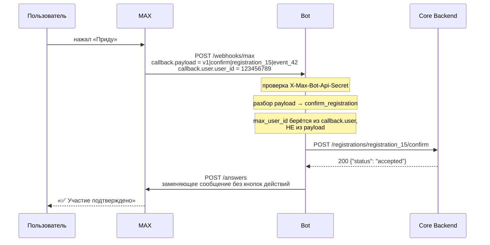
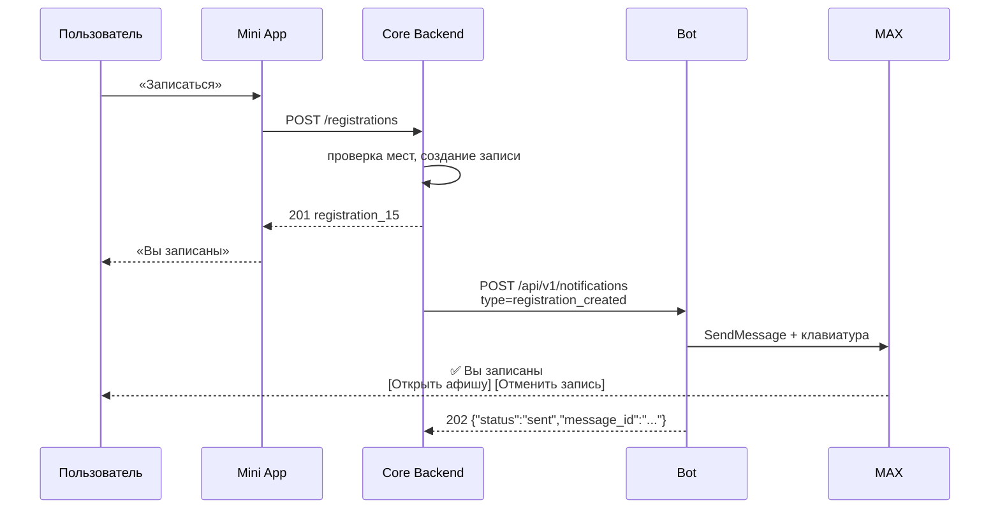
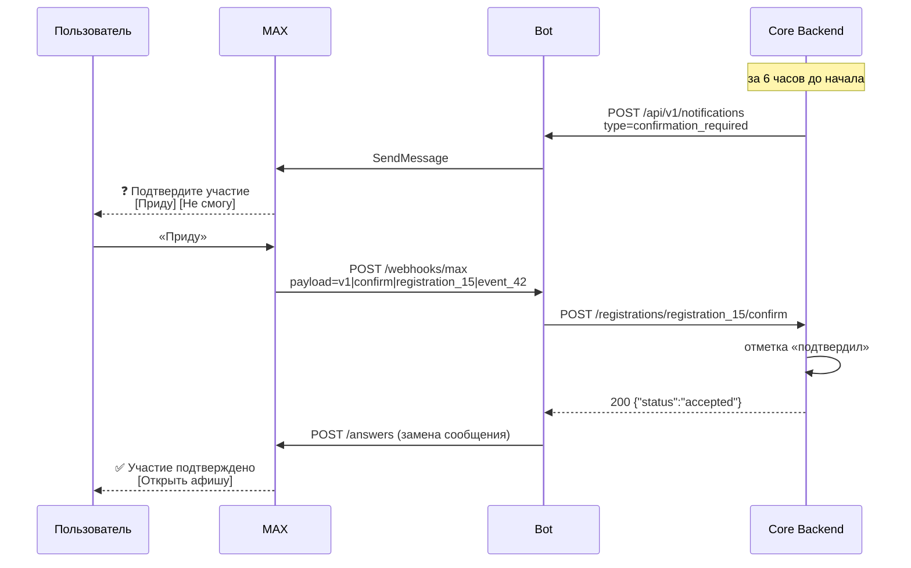
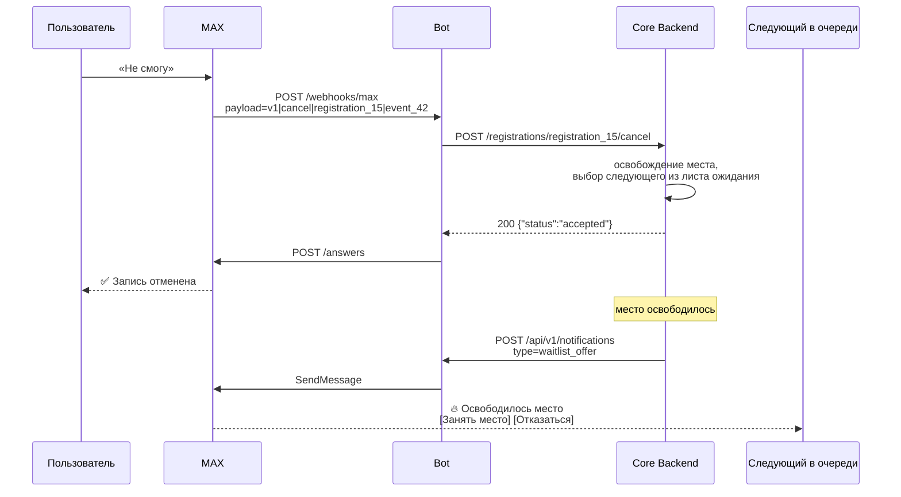
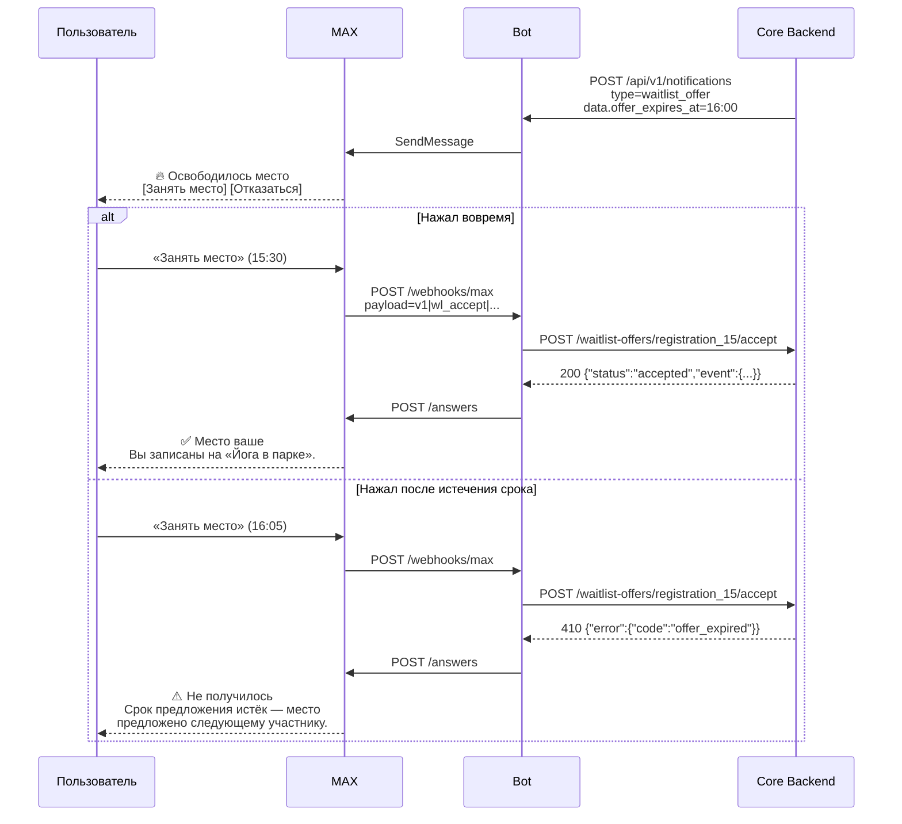

# Интеграция с Mini App и Core Backend

Документ для команды, которая делает Mini App и Core Backend. Здесь описано
всё, что нужно знать, чтобы подключиться к боту, не читая его исходники.

Машиночитаемый контракт — [`api/openapi.yaml`](../api/openapi.yaml). Этот
документ объясняет его словами и показывает, как части складываются вместе.

---

## 1. Разделение ответственности

Бот — канал доставки в MAX, и только. Он не хранит мероприятия, регистрации и
пользователей, не проверяет бизнес-правила и не принимает решений.

| Решение | Кто принимает |
|---|---|
| Есть ли свободные места | Core Backend |
| Можно ли зарегистрировать пользователя | Core Backend |
| Кто следующий в листе ожидания | Core Backend |
| Разрешена ли отмена | Core Backend |
| Существует ли мероприятие | Core Backend |
| Когда отправить напоминание | Core Backend |
| Как выглядит сообщение в MAX | Бот |
| Какие кнопки под сообщением | Бот |
| Как кодируется нажатие кнопки | Бот |

Практически это значит следующее. Если Core Backend прислал
`confirmation_required`, бот отправит сообщение — он не станет проверять, не
отменено ли мероприятие. Ответ `202` означает «сообщение передано в MAX», а не
«действие разрешено».

---

## 2. Что вам нужно сделать

Три вещи:

1. **Вызывать `POST /api/v1/notifications`**, когда пользователя нужно
   уведомить.
2. **Реализовать пять эндпоинтов**, которые вызовет бот: четыре действия по
   кнопкам и приём статуса диалога (раздел 6).
3. **Принимать эндпоинты действий от двух клиентов** — от бота и от
   мини-приложения — с разными правилами доверия (раздел 6.1). Это самое
   неочевидное место интеграции.

Пока второго и третьего нет, бот работает со StubCoreGateway: вызовы
складываются в память и видны в `GET /dev/core/actions`. Переключение на ваш
backend — это `CORE_MODE=http` в конфигурации бота, без изменений кода.

---

## 3. Отправка уведомления

```
POST /api/v1/notifications
X-Internal-Api-Key: <общий секрет>
Content-Type: application/json
X-Request-Id: <ваш correlation id, необязательно>
```

### Конверт

```json
{
  "request_id": "req_a7f3c9e1",
  "type": "confirmation_required",
  "recipient": {
    "max_user_id": 123456789
  },
  "event": {
    "id": "event_42",
    "title": "Йога в парке",
    "starts_at": "2026-09-22T19:00:00+03:00",
    "address": "Парк Горького",
    "mini_app_url": "https://afisha.example.ru/app/event_42"
  },
  "registration": {
    "id": "registration_15"
  },
  "data": {}
}
```

### Поля

| Поле | Обязательно | Описание |
|---|---|---|
| `request_id` | да | Ваш идентификатор. Ключ идемпотентности и correlation ID. |
| `type` | да | Один из восьми типов, см. раздел 4. |
| `recipient.max_user_id` | да | Числовой ID пользователя в MAX. |
| `event.id` | да | ID мероприятия. Не должен содержать `\|`. Лучше из букв, цифр, `_` и `-`: только такой id MAX примет как стартовый параметр мини-приложения (см. ниже). |
| `event.title` | да | Название, до 512 символов. |
| `event.starts_at` | да | RFC 3339 **со смещением города**, не UTC. |
| `event.address` | нет | Адрес, до 512 символов. |
| `event.mini_app_url` | нет | Абсолютная http(s)-ссылка на карточку вида `https://<хост>/app/{event_id}` — этот путь мини-приложение превращает в карточку. |
| `registration.id` | зависит от типа | Нужен всем типам, кроме `event_updated` и `event_cancelled`. Не должен содержать `\|`. |
| `data` | зависит от типа | Поля конкретного типа, см. раздел 4. |

Неизвестные поля **отвергаются** с 400. Это сделано намеренно: опечатка
`reciepient` должна быть громкой ошибкой, а не молча потерянным полем.

### Как кнопка «Открыть афишу» открывает мини-приложение

Два режима, переключаются в боте переменной `MAX_MINIAPP_BUTTON`:

- `link` (по умолчанию) — обычная ссылка на `event.mini_app_url`. Откроется в
  браузере, где мини-приложение **не получит `initData`** и не узнает
  пользователя. В режиме моков это не мешает, в боевом режиме фронт покажет
  экран «Откройте афишу в MAX».
- `open_app` — кнопка MAX, которая открывает мини-приложение **внутри
  мессенджера**, с `initData`. `event.id` передаётся ему как стартовый
  параметр; фронт уже читает его (`getStartParam()` → `consumeDeepLink`) и
  открывает карточку. Требует, чтобы мини-приложение было привязано к боту в
  MAX, — это делает владелец токена.

MAX принимает стартовый параметр только в форме `^[\w-]{0,512}$`. Для id
другого вида бот отправит ссылку вместо `open_app`, чтобы не потерять всё
уведомление из-за одной кнопки.

### Про `max_user_id`

Сопоставление «пользователь приложения → пользователь MAX» — ваша зона
ответственности. Бот этот маппинг не хранит и хранить не будет.

Получить `max_user_id` можно двумя путями:

- **Mini App**: initData от MAX содержит пользователя; SDK умеет проверять
  подпись (`maxbot.ValidateInitData(initData, botToken)`). Проверку подписи
  выполняйте на своей стороне — для этого бэкенду нужен тот же
  `MAX_BOT_TOKEN`, что и боту. Учтите: в SDK v2.4.0 `ValidateInitData`
  проверяет только подпись, а свежесть (`AuthDate`) возвращает и оставляет
  вам. Без этой проверки перехваченная однажды `initData` работает вечно.
- **Событие `bot_started`**: когда пользователь открывает диалог с ботом, MAX
  присылает его ID. Бот передаёт это вам вызовом
  `POST /max-users/{max_user_id}/bot-status` (раздел 6.2).

### Про время

Только RFC 3339 **со смещением города мероприятия**: `2026-09-22T19:00:00+03:00`.

Локализованные строки вроде «22 сентября, 19:00» **отвергаются**. Бот
форматирует дату сам в момент сборки сообщения, в часовом поясе мероприятия.
Это делает контракт однозначным и не привязывает его к одному языку.

**Время в UTC тоже отвергается** — `Z`, `+00:00`, `-00:00` дают `400` с
пояснением. Бот печатает время ровно в том смещении, в котором оно пришло, и
по голому UTC не может узнать, в каком городе мероприятие. Приняв
`2026-09-22T16:00:00Z`, он показал бы москвичу «16:00» вместо «19:00».
Правило распространяется на `event.starts_at` и `data.offer_expires_at`. Если
UTC пришлёт ваш ответ на действие (`event.starts_at` в разделе 6), бот не
упадёт: он просто не покажет время в заменяющем сообщении.

Мини-приложение следует тому же правилу (`frontend/src/lib/time.js`).

### Ответы

| Код | Значение |
|---|---|
| 202 | Сообщение сформировано и передано в MAX. |
| 200 | Дубликат: этот `request_id` уже обрабатывался, второе сообщение не отправлено. |
| 400 | Ошибка валидации. В `error.details` перечислены **все** проблемные поля сразу. |
| 401 | Неверный или отсутствующий `X-Internal-Api-Key`. |
| 413 | Тело больше 64 KiB. |
| 422 | `recipient_unavailable`: MAX отказался доставить сообщение этому пользователю — он остановил бота или ни разу не открывал с ним диалог. **Не повторяйте**: не поможет, пока пользователь снова не откроет диалог. Отметьте его как недоступного для бота. `request_id` освобождается, так что то же уведомление можно отправить позже. |
| 502 | MAX недоступен. Имеет смысл повторить. |
| 500 | Ошибка внутри бота. |

Успешный ответ:

```json
{
  "request_id": "req_a7f3c9e1",
  "status": "sent",
  "message_id": "mid-abc123"
}
```

Ошибка валидации:

```json
{
  "error": {
    "code": "invalid_request",
    "message": "registration.id is required for type \"confirmation_required\" (and 1 more problem(s))",
    "request_id": "req-9217b3805210af54",
    "details": [
      { "field": "event.starts_at", "message": "must be an RFC3339 timestamp, e.g. 2026-09-22T19:00:00+03:00" },
      { "field": "registration.id", "message": "is required for type \"confirmation_required\"" }
    ]
  }
}
```

---

## 4. Типы уведомлений

### `registration_created` — пользователь записался

```json
{
  "request_id": "req_1",
  "type": "registration_created",
  "recipient": { "max_user_id": 123456789 },
  "event": {
    "id": "event_42",
    "title": "Йога в парке",
    "starts_at": "2026-09-22T19:00:00+03:00",
    "address": "Парк Горького",
    "mini_app_url": "https://afisha.example.ru/app/event_42"
  },
  "registration": { "id": "registration_15" }
}
```

Кнопки: «Открыть афишу», «Отменить запись».

### `reminder_24h` — напоминание за сутки

Тот же конверт, `type: "reminder_24h"`.
Кнопки: «Открыть афишу», «Не смогу прийти».

### `confirmation_required` — подтверждение за 6 часов

Тот же конверт, `type: "confirmation_required"`.
Кнопки: «Приду», «Не смогу».

### `confirmation_retry` — повторное подтверждение

Тот же конверт, `type: "confirmation_retry"`.
Кнопки те же. Текст намеренно совпадает с первым запросом: человеку, который
проигнорировал прошлое сообщение, не поможет напоминание о том, что он его
проигнорировал.

### `reminder_1h` — скоро начало

Тот же конверт, `type: "reminder_1h"`. Передайте `event.address`: при его
наличии первой кнопкой будет «Маршрут».
Кнопки: «Маршрут» / «Открыть афишу», «Не смогу прийти».

### `waitlist_offer` — освободилось место

```json
{
  "request_id": "req_6",
  "type": "waitlist_offer",
  "recipient": { "max_user_id": 123456789 },
  "event": {
    "id": "event_42",
    "title": "Йога в парке",
    "starts_at": "2026-09-22T19:00:00+03:00",
    "address": "Парк Горького",
    "mini_app_url": "https://afisha.example.ru/app/event_42"
  },
  "registration": { "id": "registration_15" },
  "data": {
    "offer_expires_at": "2026-09-22T16:00:00+03:00"
  }
}
```

`data.offer_expires_at` обязателен. Кнопки: «Занять место», «Отказаться».

Важно: бот не следит за истечением предложения. Когда срок выйдет, кнопки в
чате останутся активными — и ваш backend должен ответить `offer_expired` на
запоздавшее нажатие. Бот покажет пользователю «Срок предложения истёк — место
предложено следующему участнику».

### `event_updated` — мероприятие изменено

```json
{
  "request_id": "req_7",
  "type": "event_updated",
  "recipient": { "max_user_id": 123456789 },
  "event": {
    "id": "event_42",
    "title": "Йога в парке",
    "starts_at": "2026-09-22T20:00:00+03:00",
    "address": "Парк Сокольники",
    "mini_app_url": "https://afisha.example.ru/app/event_42"
  },
  "data": {
    "changes": [
      { "field": "time",    "old": "19:00",          "new": "20:00" },
      { "field": "address", "old": "Парк Горького",  "new": "Парк Сокольники" }
    ],
    "organizer_message": "Вход со стороны главной аллеи."
  }
}
```

`registration` не нужен. Требуется `data.changes` либо
`data.organizer_message`: сообщение «что-то изменилось» без указания, что
именно, пользователю бесполезно.

`field` — машиночитаемый ключ. Известные: `time`, `address`, `title`, `other`.
**Неизвестные ключи тоже отображаются** — так вы сможете ввести новый вид
изменения без релиза бота. `old` и `new` — уже человекочитаемые строки: только
организатор знает, как сформулировать «перенесено к восточному входу».

`event.starts_at` должен содержать **новое** время: бот покажет его в строке
«Начало».

### `event_cancelled` — мероприятие отменено

```json
{
  "request_id": "req_8",
  "type": "event_cancelled",
  "recipient": { "max_user_id": 123456789 },
  "event": {
    "id": "event_42",
    "title": "Йога в парке",
    "starts_at": "2026-09-22T19:00:00+03:00",
    "mini_app_url": "https://afisha.example.ru/app/event_42"
  },
  "data": {
    "organizer_message": "Из-за штормового предупреждения занятие не состоится."
  }
}
```

`registration` не нужен, кнопок действий нет — подтверждать нечего.

---

## 5. Что происходит при нажатии кнопки



Ключевые моменты:

- Бот сам решает, что означает нажатая кнопка: команда закодирована в payload
  (`v1|confirm|...`), текст кнопки командой не является.
- `max_user_id` берётся из `callback.user.user_id` — того, кто нажал кнопку, —
  и никогда из payload. Payload проходит через клиент и не может считаться
  доверенным источником сведений об идентичности.
- После успешного действия сообщение заменяется, кнопки действий снимаются.
  Повторное нажатие невозможно.

---

## 6. Что должен реализовать Core Backend

Пять эндпоинтов. Бот вызывает их при `CORE_MODE=http`.

| Событие | Запрос бота |
|---|---|
| «Приду» | `POST {CORE_BASE_URL}/registrations/{registration_id}/confirm` |
| «Не смогу» / «Отменить запись» | `POST {CORE_BASE_URL}/registrations/{registration_id}/cancel` |
| «Занять место» | `POST {CORE_BASE_URL}/waitlist-offers/{registration_id}/accept` |
| «Отказаться» | `POST {CORE_BASE_URL}/waitlist-offers/{registration_id}/decline` |
| Пользователь открыл, остановил бота или удалил диалог | `POST {CORE_BASE_URL}/max-users/{max_user_id}/bot-status` (раздел 6.2) |

Плюс `GET {CORE_BASE_URL}/health` — используется только в `/ready` бота.

### 6.1 Два клиента, два режима доверия

Эндпоинты действий — `confirm`, `cancel`, `accept`, `decline` — вызывают
**двое**: бот, когда пользователь нажал кнопку в мессенджере, и
мини-приложение, когда он нажал ту же кнопку на экране. Пути и тело у них
одинаковые, а вот правила, кому верить, разные.

| | Бот | Мини-приложение |
|---|---|---|
| Кто это | ваш сервис | браузер пользователя, то есть интернет |
| Аутентификация | `X-Api-Key: <CORE_API_KEY>` | `Authorization: Bearer <токен сессии>` из `POST /auth/max` |
| Кто действует | `max_user_id` из тела запроса | пользователь сессии |
| `max_user_id` в теле | **источник личности**: бот взял его из события MAX, а не из кнопки | **не доверять**: сверить с сессией, при расхождении — `403` |

Почему так. У бота нет сессии пользователя: MAX присылает ему событие
«нажата кнопка», и в нём указано, кто нажал. Это и есть личность, и бот
передаёт её в `max_user_id`. Запрос приходит с сервисным ключом, который
знают только бот и вы, поэтому `max_user_id` из него — достоверный.

Мини-приложение приходит из браузера. Любой пользователь может отправить
любое тело, поэтому `max_user_id` из него ничего не доказывает. Личность
здесь берётся из сессии, которую вы выдали после проверки подписи `initData`.

**Главный риск.** Моки мини-приложения (`frontend/src/api/mocks/handlers.js`)
фактически и есть спецификация бэкенда, и в них смоделирован только второй
режим: действия берут пользователя из сессии. Если написать бэкенд строго по
мокам, каждое нажатие кнопки в боте получит `401` или `403`, и пользователь
увидит «действие недоступно». Из мини-приложения при этом всё будет работать,
поэтому заметить это до демонстрации легко пропустить.

Минимальная реализация — один обработчик, два способа установить личность:

```go
func actor(r *http.Request, body actionBody) (userID int64, err error) {
    if key := r.Header.Get("X-Api-Key"); key != "" {
        if !constantTimeEqual(key, cfg.BotAPIKey) {
            return 0, errUnauthorized
        }
        return body.MaxUserID, nil // бот: личность из тела
    }
    session, err := sessionFrom(r) // мини-приложение: личность из сессии
    if err != nil {
        return 0, errUnauthorized
    }
    if body.MaxUserID != 0 && body.MaxUserID != session.MaxUserID {
        return 0, errForbidden
    }
    return session.MaxUserID, nil
}
```

Остальная логика — места, очередь, сроки, идемпотентность — у обоих клиентов
общая, и отвечать им нужно одинаково: оба понимают один и тот же словарь
ошибок (раздел «Ответы с ошибкой»).

`cancel_reason` в теле отмены (`ill`, `plans_changed`, `other`) присылает
только мини-приложение. Бот его не передаёт: у кнопки «Не смогу прийти» нет
вопроса о причине.

### 6.2 Статус диалога: `POST /max-users/{max_user_id}/bot-status`

Только бот знает, может ли он написать пользователю: MAX сообщает об этом ему
и больше никому. Мини-приложению это нужно для баннера «Бот не может написать
вам» и пометки «Нет связи с ботом» у участников (`bot_available`).

```
POST /max-users/123456789/bot-status
X-Api-Key: <CORE_API_KEY>
X-Request-Id: req-5e1a0c2f9b7d4e11
Content-Type: application/json
```

```json
{
  "max_user_id": 123456789,
  "available": false,
  "reason": "bot_stopped",
  "occurred_at": "2026-09-28T10:00:00Z",
  "request_id": "req-5e1a0c2f9b7d4e11"
}
```

| `reason` | Когда | `available` |
|---|---|---|
| `bot_started` | пользователь открыл диалог или нажал «Начать» | `true` |
| `bot_stopped` | пользователь остановил бота | `false` |
| `dialog_removed` | пользователь удалил диалог с ботом | `false` |

Ответ — любой `2xx`, тело бот не читает. Вызов идемпотентен по смыслу:
побеждает последний статус, дедупликация не нужна. Сбой бот записывает в лог и
не повторяет: на пользователя он не влияет.

Есть и второй источник того же знания. Если вы отправили уведомление
пользователю, который закрыл диалог, бот ответит `422 recipient_unavailable`
(раздел 3). Считайте это таким же сигналом `available=false`.

### Запрос

```
POST /registrations/registration_15/confirm
X-Api-Key: <CORE_API_KEY>
X-Request-Id: req-9217b3805210af54
Content-Type: application/json
```

```json
{
  "registration_id": "registration_15",
  "event_id": "event_42",
  "max_user_id": 123456789,
  "request_id": "req-9217b3805210af54",
  "occurred_at": "2026-09-22T16:00:00Z"
}
```

Идентификаторы продублированы в теле намеренно: так запрос самодостаточен для
логирования и повтора, и не потребует переделки, если вы позже перейдёте на
единую RPC-точку.

`occurred_at` — момент нажатия кнопки по данным MAX. Он может заметно
отличаться от момента получения запроса, если доставка webhook задержалась;
для проверки истёкшего предложения ориентируйтесь на него.

### Успешный ответ

Минимальный:

```json
{ "status": "accepted" }
```

Если действие уже было применено раньше — `"status": "noop"`. Это не ошибка:
пользователь, нажавший «Приду» дважды, не должен видеть сообщение о проблеме.

Расширенный — с ним бот покажет актуальные данные вместо тех, что были в
исходном уведомлении:

```json
{
  "status": "accepted",
  "event": {
    "id": "event_42",
    "title": "Йога в парке",
    "starts_at": "2026-09-22T19:00:00+03:00",
    "address": "Парк Горького"
  }
}
```

Пустое тело с кодом 2xx тоже считается успехом: действие произошло, и терять
его из-за детали сериализации неправильно.

### Ответы с ошибкой

```json
{
  "error": {
    "code": "offer_expired",
    "message": "offer for registration_15 expired at 16:00"
  }
}
```

| `code` | HTTP | Что увидит пользователь |
|---|---|---|
| `event_cancelled` | 409 | «Мероприятие отменено организатором, подтверждать участие не нужно.» |
| `registration_cancelled` | 409 | «Эта запись уже отменена.» |
| `offer_expired` | 410 | «Срок предложения истёк — место предложено следующему участнику.» |
| `not_found` | 404 | «Не удалось найти эту запись...» |
| `conflict` | 409 | «Сейчас это действие недоступно...» |
| `forbidden` | 403 | «Сейчас это действие недоступно...» |

Принимаются также синонимы: `registration_not_found`, `event_not_found`,
`waitlist_offer_expired`, `event_canceled`, `registration_canceled`.
Неизвестный код не ломает бота — он подставит сообщение по HTTP-статусу.

`message` попадает в логи бота, но **никогда не показывается пользователю**.
Пишите туда то, что поможет отладке.

**5xx** трактуется как «недоступен»: бот покажет «Сервис временно недоступен,
попробуйте ещё раз через пару минут» и **оставит кнопки на месте**, чтобы
пользователь мог повторить. Не отвечайте 5xx на бизнес-отказ — пользователь
будет бесконечно нажимать кнопку, которая никогда не сработает.

### Таймауты

Бот ждёт ответа `CORE_TIMEOUT` (по умолчанию 5 секунд). Таймаут трактуется как
«недоступен»: бот не может знать исход и не станет утверждать, что действие
выполнено.

Отсюда практическое требование: **делайте эти эндпоинты идемпотентными по
`request_id`**. При таймауте бот не повторяет запрос сам, но пользователь может
нажать кнопку ещё раз, и второй вызов не должен создавать второй эффект.

---

## 7. Sequence-диаграммы сценариев

### Регистрация на мероприятие



### Подтверждение участия



### Отказ от участия



### Лист ожидания: успех и истёкшее предложение



---

## 8. Аутентификация

Три разных секрета. Их легко перепутать, и каждый защищает свою границу.

| Секрет | Направление | Заголовок | Настраивается |
|---|---|---|---|
| `INTERNAL_API_KEY` | Core Backend → Bot | `X-Internal-Api-Key` | в конфигурации бота |
| `CORE_API_KEY` | Bot → Core Backend | `X-Api-Key` | в конфигурации бота |
| `MAX_WEBHOOK_SECRET` | MAX → Bot | `X-Max-Bot-Api-Secret` | при подписке на webhook |

Сравнение секретов выполняется за константное время: наивное `==` утекает
материал ключа через тайминг ответа.

---

## 9. Идемпотентность

### На стороне бота

`request_id` — ключ. Повторный запрос с тем же значением вернёт `200` и
`"duplicate": true`, второе сообщение пользователю не уйдёт.

**Ограничение, о котором нужно знать:** дедупликация хранится в памяти
процесса (TTL по умолчанию 30 минут), не переживает рестарт и не разделяется
между репликами. Для MVP это осознанный размен — у бота нет собственных
бизнес-данных, ради которых стоило бы поднимать Redis. Если появится вторая
реплика бота, понадобится общее хранилище.

Практический вывод: **генерируйте `request_id` детерминированно** для
логически одного уведомления, например
`notif_{registration_id}_{type}_{scheduled_at}`. Тогда ваш собственный retry
не приведёт к двум сообщениям.

### На стороне Core Backend

Бот передаёт `request_id` и в заголовке `X-Request-Id`, и в теле. Сделайте
обработку действий идемпотентной по нему: при таймауте бот не повторяет запрос,
но пользователь может нажать кнопку снова.

---

## 10. Correlation ID

- Передавайте `X-Request-Id` в `POST /api/v1/notifications` — бот использует
  его как есть, пишет во все логи по этому уведомлению и возвращает в ответе.
- Если не передан — бот сгенерирует свой (`req-<hex>`).
- Для входящих webhook бот генерирует ID и передаёт его в `X-Request-Id` при
  вызове ваших эндпоинтов.
- В теле ошибки ID тоже присутствует (`error.request_id`).

Так трасса «Mini App → Core Backend → Bot → MAX» сшивается по одному
идентификатору.

---

## 11. Как проверить интеграцию до того, как всё готово

Бот полностью работоспособен на заглушках прямо сейчас:

```bash
make run    # MAX_MODE=mock, CORE_MODE=stub
```

1. Отправьте уведомление на `POST /api/v1/notifications`.
2. Посмотрите `GET /dev/max/messages` — там текст сообщения и payload кнопок.
3. Отправьте имитацию нажатия на `POST /webhooks/max` (пример есть в
   [POSTMAN.md](POSTMAN.md)).
4. Посмотрите `GET /dev/core/actions` — там действие, которое пришло бы в ваш
   backend, с точными полями запроса.

Шаг 4 особенно полезен: вы увидите ровно те данные, которые получите, когда
переключите `CORE_MODE=http`.

Готовая коллекция Postman лежит в [`postman/`](../postman/).
