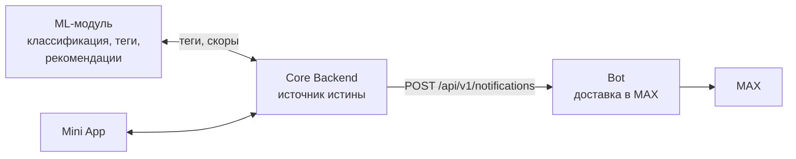
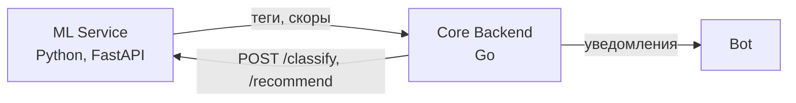
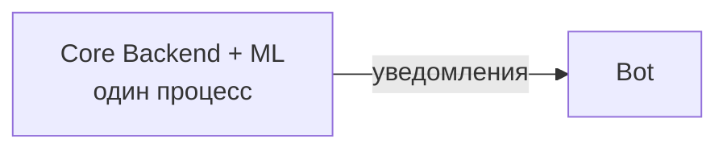

# ML и бот: границы ответственности

Документ для разработчика ML-модуля. Короткий вывод в одном абзаце: **бот от
ML не зависит и зависеть не должен**. Ничего интегрировать сейчас не нужно.
Ниже — почему так, и как это будет выглядеть, если рекомендации всё-таки
доберутся до чата.

---

## 1. Текущее положение дел

Бот делает ровно одно: доставляет в MAX уведомления по конкретным
мероприятиям, на которые пользователь **уже записан**, и принимает его ответы
по кнопкам.

Все восемь типов сообщений — подтверждение записи, напоминания, подтверждение
участия, предложение места из листа ожидания, изменение и отмена
мероприятия — про конкретную существующую регистрацию. Ни в одном из них нет
ни подбора, ни ранжирования, ни персонализации.

Поэтому:

- **в Go-коде бота нет и не будет Python-зависимостей;**
- **фиктивный ML API «на будущее» не создан** — интерфейс без потребителя
  стареет быстрее, чем появляется реальная задача;
- **бот не вызывает ML ни напрямую, ни через очередь.**

---

## 2. Рекомендуемая архитектура

ML общается с Core Backend. Бот общается с Core Backend. Друг с другом они не
общаются.



### Почему именно так

**Бот — адаптер к мессенджеру, а не участник принятия решений.** Он не знает
про места, регистрации и очереди — эти решения принимает Core Backend. Знание
о том, что пользователю стоит порекомендовать, — решение того же рода и
принадлежит тому же слою.

**Прямая связь ML → Bot создала бы вторую точку истины.** Появился бы вопрос,
чьи данные правильнее, если ML и Core Backend разошлись. У системы с двумя
источниками истины этот вопрос возникает не «если», а «когда».

**Это сохраняет право на ошибку.** Пока ML прячется за Core Backend, смена
модели, переезд на другой фреймворк или временное отключение ML не требуют
ни одного изменения в боте.

**Языковая граница совпадает с сетевой.** Go-сервис и Python-сервис общаются
по HTTP или через очередь — и пусть эта граница будет одна, а не две.

---

## 3. Оба варианта размещения ML

Боту безразлично, какой из них вы выберете. Это тоже аргумент в пользу
схемы выше.

### Вариант А — ML как отдельный Python-сервис



Со стороны бота **не меняется ничего**. Он даже не узнает о существовании
ML-сервиса.

Практические соображения для этой границы: синхронные вызовы стоит ограничить
таймаутом (рекомендации не должны задерживать ответ пользователю), а тяжёлую
классификацию лучше выполнять асинхронно, складывая результат в базу Core
Backend.

### Вариант Б — ML внутри Core Backend

Если модель простая (эмбеддинги, линейный классификатор, правила) и её можно
исполнять на Go или через ONNX Runtime.



Со стороны бота — **тоже ничего не меняется**.

Выбирайте по реальным ограничениям: размеру модели, требованиям к задержке,
удобству обновления весов и тому, насколько тесно ML-логика переплетена с
бизнес-данными.

---

## 4. Какие данные от ML могут попасть в сообщения

Сейчас — никакие. В обозримом будущем реалистичны несколько вариантов, и все
они приходят в бота **уже в готовом виде**, через существующий контракт
`POST /api/v1/notifications`.

### Теги в описании мероприятия

Если ML проставил мероприятию теги («йога», «на открытом воздухе», «для
начинающих»), они могут попасть в текст уведомления. Для бота это обычная
строка в поле события — от того, что её сгенерировала модель, ничего не
меняется.

Потребуется добавить необязательное поле в контракт (например,
`event.tags: string[]`) и одну строку в рендерер. Со стороны ML — ничего.

### Пояснение к рекомендации

Если однажды появится уведомление в духе «Вам может понравиться…», текст
объяснения («потому что вы ходили на йогу») формирует Core Backend на основе
данных от ML. Бот получает готовую строку.

### Приоритизация уведомлений

Если ML предскажет, что пользователь с высокой вероятностью не придёт, Core
Backend может отправить ему `confirmation_required` раньше остальных. Это
целиком решение планировщика на стороне Core Backend — бот просто получит
команду в другой момент времени.

**Общий принцип: ML влияет на то, *что* и *когда* отправить. Бот отвечает за
то, *как* это выглядит в MAX.**

---

## 5. Что изменится в боте, если появятся ML-рекомендации

Допустим, задача поставлена: присылать персональную подборку мероприятий.

Со стороны ML — **ничего**. Вы по-прежнему отдаёте результат в Core Backend.

Со стороны бота работа небольшая и локализованная:

1. Новый тип уведомления в `domain.NotificationType`, например
   `recommendations`.
2. Новые поля в контракте (`internal/contracts`) — список мероприятий.
3. Новый метод рендерера с текстом и клавиатурой.
4. Новое действие в кодеке callback, если у подборки будут интерактивные
   кнопки.

Работы примерно на полдня, и ни один существующий тип сообщений при этом не
затрагивается.

### Если боту всё же понадобится обращаться к ML напрямую

Такого сценария сейчас не видно, но если он появится — например, интерактивный
подбор прямо в чате, где ходить через Core Backend было бы лишним звеном, —
делать это надо через отдельный порт, а не прямым импортом:

```go
// internal/recommend/provider.go
type Provider interface {
    ForUser(ctx context.Context, maxUserID int64, limit int) ([]domain.Event, error)
}
```

С реализациями `stub` (для разработки) и `http` (для боевого контура) — ровно
той же схемой, что уже применена для `CoreGateway` и `MaxClient`. Прямой
импорт ML-кода или запуск Python из Go-процесса не станет приемлемым решением
ни при каком раскладе: это смешало бы среды выполнения, сломало сборку
статического бинарника и сделало бы отладку кошмаром.

---

## 6. Что ML-разработчику делать прямо сейчас

Ничего для бота. Серьёзно.

Разрабатывайте модуль так, будто бота не существует: его потребитель — Core
Backend, и контракт нужно согласовывать с его командой.

Если хочется посмотреть, как выглядит конечный результат вашей работы в
мессенджере:

```bash
make run
make smoke
```

Второе поднимет бота на заглушках и проведёт полный цикл. Сообщения, которые
получил бы пользователь, видны так:

```bash
curl -s localhost:8080/dev/max/messages | jq '.messages[].text'
```

Ни токена MAX, ни интернета, ни Python для этого не нужно.

---

## 7. Краткая сводка

| Вопрос | Ответ |
|---|---|
| Зависит ли бот от ML? | Нет |
| Нужно ли ML вызывать бота? | Нет |
| Нужно ли боту вызывать ML? | Нет |
| Через кого идёт взаимодействие? | Через Core Backend |
| Что если ML — отдельный Python-сервис? | В боте не меняется ничего |
| Что если ML внутри Core Backend? | В боте не меняется ничего |
| Есть ли в боте Python-зависимости? | Нет и не будет |
| Есть ли заготовка ML API «на будущее»? | Нет — намеренно |
| Что если появятся рекомендации в чате? | Новый тип уведомления в боте; со стороны ML ничего |
